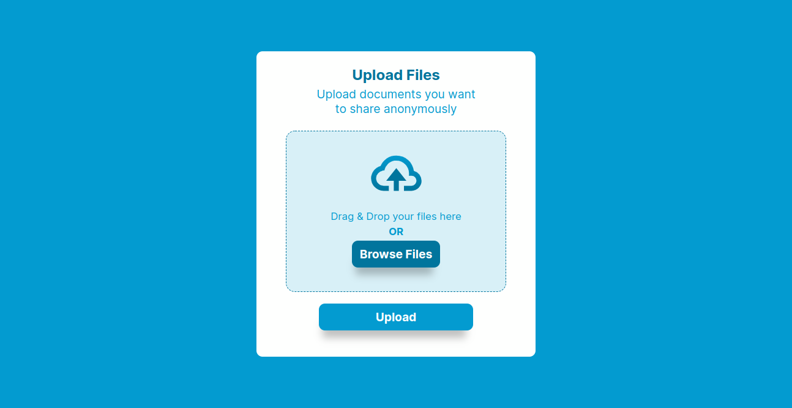
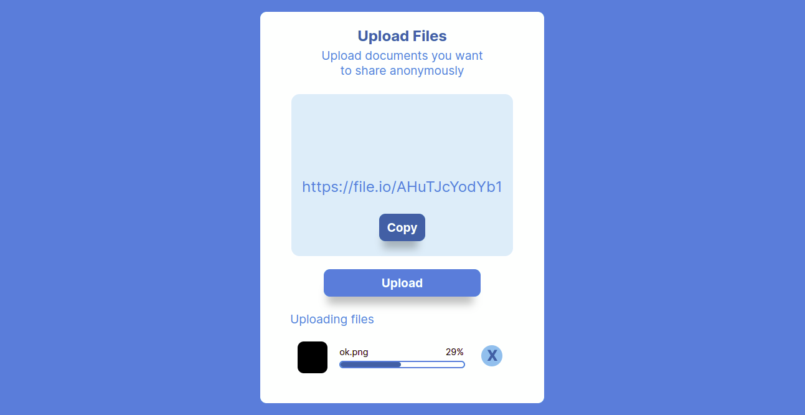

# Anonymously Upload Files

***

## Creator :man_technologist:

Upload Files Page was created and is maintained by **Kelvin Njoro**

* [Twitter](https://twitter.com/kelvinprincipal/)
* [Github](https://github.com/principalkelvo/)
* [Facebook](https://facebook.com/principal.kelvin1/)

## Design

### Full Preview

### uploading Preview

For full design click [image](https://www.figma.com/file/gy6b2ASwlPJkb0W9UsPyIE/Anonymous-file-sharing-and-text?node-id=1%3A2)

## Description

>> Data transmission over the internet has never been simpler, but sending sensitive information over email or a cloud service could be a mistake. There is always a danger that data could be intercepted, and in some circumstances, this could be disastrous. In many circumstances, it may be preferable to physically deliver data to a recipient using a secure storage mechanism, however this is frequently not feasible. The good news is that you can transmit files to other individuals using this anonymous file-sharing service without revealing any personal information about you or the recipient. This project is done by using HTML, CSS and JS only to create a cool Upload Files page. It is a fully developed light mode for all gadgets.

### Contains

* A display -
  * with the title
  * and files drop area/ browse file button
* Upload button
* Progress Section
* Build with :smiling_face_with_three_hearts:

### Features

* Static Html page - no fancy hosting needed (Github pages does it for free)
* Light source code - fast to load
* Beautiful interface - compatible with all desktops and with a beautiful and pleasant interface.
* Dark mode- still under construction
* Responsive - compatible with all gadgets.

### Requirements

* Access to  a computer or any other gadget
* Access to internet

### Setup and installation

> To view the website,

* Click [Here](https://principalkelvo.github.io/anonymous-file-sharing/) **or**
* Copy the link https://principalkelvo.github.io/anonymous-file-sharing/ paste to your browser and load it

### Built with

* HTML - which was used to develop the structure off the pages.
* CSS - which was used to style the User Interface.
* JS - which was used to create a great interaction with the User Interface.

## Bugs and Issues

>Have a bug or issue? Open a new issue here on Github

### Known Bugs

* There are no known bugs

## Image Attribution

>Images owned by Kelvin Njoro
>Free for personal use with attribution

## Credits

* [Google Fonts](https://fonts.google.com/) - Chivo and Lora
* [File.io API](https://file.io/)

## License

> Use it freely but please do not republish, distribute or sell
>Thats it! Simple, clean and smooth!